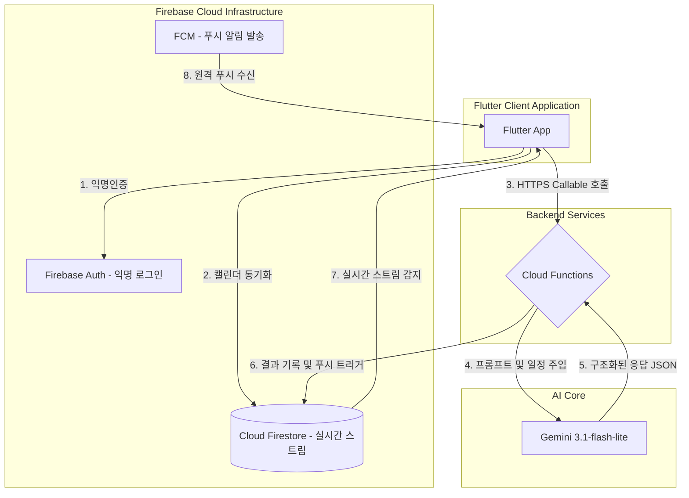

# 마중 (Majung) - Flutter Project

마음의 무게를 덜어주는 대화형 일기 및 마음 케어 솔루션, **마중(Majung)** 플러터 애플리케이션 프로젝트입니다.

> **플랫폼**: iOS · Android · Web  
> **Firebase 프로젝트 ID**: `majung-ce508`  
> **Flutter SDK**: ^3.12.0 · **상태관리**: Riverpod 3.x · **AI**: Gemini 3.1-flash-lite (Cloud Functions)

---

## 데모 및 구동 영상

- [마중(Majung) 애플리케이션 시연 영상 (YouTube Shorts)](https://youtube.com/shorts/nelT6GJD5iM)

---

## 앱 개요

"마중(마중이)"은 AI 마스코트 캐릭터와의 공감 대화를 통해 일기를 자동 생성하고, 기분을 5단계로 추적하며, 맞춤 행동을 추천하는 정서 케어 앱입니다.

| 화면 | 기능 요약 |
|------|-----------|
| **스플래시** | 시작 버튼 없이 1.5초 노출 후 자동 로그인 및 Fade 라우팅 전환 |
| **온보딩** | 6단계 (이름·말투·캘린더 동의·사진·알림 권한 설정) |
| **홈** | 최신 추천 행동 카드 + 최근 일기 프리뷰, 하단 탭 내비게이션 |
| **채팅** | AI 대화 모드 / 직접 쓰기 모드 ➡️ 일기 자동 생성 |
| **캘린더** | 월간 뷰, 기분 색상 표시, 날짜별 일기 프리뷰 |
| **리포트** | 주간/월간 편지 수신함 (존댓말/반말 이중 버전 제공) |
| **행동 모음** | 추천 행동 라이브러리, 하트 즐겨찾기 |
| **알림** | FCM 푸시 알림 수신 히스토리 및 읽음 처리 |

---

## 시스템 아키텍처



### 데이터 흐름 및 보안 메커니즘

* **App ➡️ Auth (익명인증)**: 사용자가 앱을 켜면 백그라운드에서 자동으로 익명 로그인을 진행해 고유 UID(열쇠)를 획득합니다.
* **App ➡️ DB (캘린더 동기화)**: 획득한 UID를 경로로 삼아 오늘 일정을 Firestore에 기록합니다.
* **App ➡️ Func (대화 전송)**: 사용자가 채팅을 보내면 백엔드(Cloud Functions)를 호출합니다.
* **Func ➡️ Gemini**: 백엔드가 해당 UID의 오늘 일정과 채팅 내용을 모아 AI에게 전달합니다.
* **Gemini ➡️ Func**: AI가 구조화된 답변을 백엔드에 반환합니다.
* **Func ➡️ DB**: 백엔드가 AI의 최종 분석 결과를 해당 사용자의 UID 하위 경로(`users/{UID}/diaries`)에 기록합니다.
* **DB ➡️ App**: 사용자의 식별자(UID) 보관함에 새 일기가 기록되면 실시간 스트림이 감지되어 화면이 갱신됩니다.

---

## AI & 데이터 파이프라인

단순히 AI 대답만 불러오는 것이 아니라, 다음과 같이 정교한 데이터 연동을 통해 대화의 완성도와 안정성을 높였습니다.

1. **오늘 일정 기반의 맞춤형 대화**:
   * 스마트폰 캘린더에 등록된 **오늘의 실제 일정(예: 면접, 예약 등)**을 조회하여 대화 시작 시 AI에게 전달합니다. 이를 통해 캐릭터가 사용자의 일정을 인지하고 "오늘 면접은 잘 다녀오셨나요?"와 같이 먼저 맞춤형 위로와 안부를 건넵니다.
2. **안정적인 데이터 형식 통일 (JSON 규격화)**:
   * AI가 매번 다른 형식으로 길게 답변하여 발생하는 시스템 에러를 방지하기 위해, 백엔드 서버에서 응답 형식을 철저히 고정(JSON 규격)했습니다. AI가 항상 약속된 데이터(대답 본문, 행동 추천 여부, 추천 리스트)로만 결과물을 반환하게 강제하여 오류 없이 안정적으로 작동합니다.
3. **말투 설정 자동 동기화 (반말/존댓말)**:
   * 사용자가 설정한 말투(반말 혹은 존댓말)에 맞춰 인공지능 캐릭터의 답변 톤은 물론 앱 내의 모든 안내 문구가 하나로 연동되어 작동하며, 일관성 있는 대화 페르소나를 제공합니다.

---

## 주요 아키텍처 및 폴더 구조

도메인 및 아키텍처 레이어별 관심사 분리(Separation of Concerns)를 극대화하도록 구조가 정의되어 있습니다.

```
lib/
├── main.dart                   # 앱 진입점, Firebase 초기화, 자동 로그인 & 스플래시 화면
├── firebase_options.dart       # 플랫폼별 Firebase 설정 (자동 생성)
├── theme.dart                  # 디자인 토큰 (색상, 타이포그래피)
├── models/                     # 불변 데이터 모델 (일기, 채팅, 활동, 리포트, 알림, 화면상태)
├── providers/                  # Riverpod 3.x Notifier 기반 상태 관리 (대화, 설정, 캘린더 등)
├── repositories/               # Firestore 데이터 액세스 계층 (5종)
├── services/
│   ├── calendar_service.dart   # 기기 캘린더 이벤트 동기화
│   ├── fcm_service.dart        # FCM 초기화, 토큰 관리, 서버 데이터 동기화
│   └── gemini_service.dart     # Gemini AI 연동
├── utils/
│   ├── speech_dictionary.dart  # 존댓말/반말 UI 문자열 일원화 사전
│   ├── permission_manager.dart # 사진/캘린더/알림 권한 처리
│   └── datetime_extension.dart # 날짜 포맷 헬퍼
├── widgets/                    # 재사용 UI 공통 컴포넌트 및 설정 컴포넌트
└── screens/
    ├── onboarding/             # 6단계 온보딩 시퀀스
    ├── chat/                   # AI 대화방, 직접 쓰기, 일기 완료/로딩
    ├── calendar/               # 월간 달력 뷰 + 일기 프리뷰
    ├── report/                 # 우편함 및 주간/월간 리포트 상세
    ├── home_screen.dart        # 홈 화면 (하단 내비게이션 허브)
    ├── error_screen.dart       # 공용 에러/예외 화면
    ├── activity_collection_screen.dart  # 추천 행동 라이브러리
    └── notification_screen.dart         # FCM 알림 히스토리
```

### Riverpod 상태 관리 (`lib/providers/`)

| Provider | 책임 |
|----------|------|
| `userNameProvider` | 사용자 이름 저장/로드 |
| `selectedStyleProvider` | 말투 선택 (0=반말, 1=존댓말) |
| `toggleStateProvider` | 알림 on/off |
| `chatProvider` | 채팅방 대화 메시지, 타이핑 상태, 전송대기 이미지, 추천 행동 제어 |
| `diaryListProvider` | 전체 일기 목록 실시간 스트림 |
| `selectedCalendarDateProvider` | 달력 선택 날짜 |
| `calendarMonthProvider` | 달력 표시 월 |
| `diaryProvider` | 단일 일기 생성 상태 |
| `activityListProvider` | 추천 행동 라이브러리 |
| `reportListProvider` | 리포트 목록 실시간 스트림 |
| `reportTabProvider` | 주간/월간 탭 선택 |
| `filteredReportsProvider` | 탭 기준 필터링된 리포트 |
| `directWriteProvider` | 직접 쓰기 폼 상태 |
| `notificationProvider` | FCM 알림 히스토리 |

### Firestore 리포지토리 (`lib/repositories/`)

| 리포지토리 | 담당 컬렉션 |
|-----------|------------|
| `UserRepository` | `users/{uid}` — 이름, 말투, FCM 토큰, 캘린더 이벤트 |
| `DiaryRepository` | `users/{uid}/diaries` — CRUD + 실시간 스트림 |
| `ActivityRepository` | `users/{uid}/activities` — 좋아요, 날짜 이력 |
| `ReportRepository` | `users/{uid}/reports` — 실시간 스트림 |
| `NotificationRepository` | `users/{uid}/notifications` — 읽음 처리, 삭제 |

---

## 실행 방법

1. iOS/Android 실기기 또는 에뮬레이터를 준비합니다.
2. 로컬에서 파이어베이스 함수 에뮬레이터를 띄웁니다:
   ```bash
   cd functions && npm run serve
   ```
3. Flutter 프로젝트 루트 경로에서 앱을 가동합니다:
   ```bash
   flutter run
   ```
